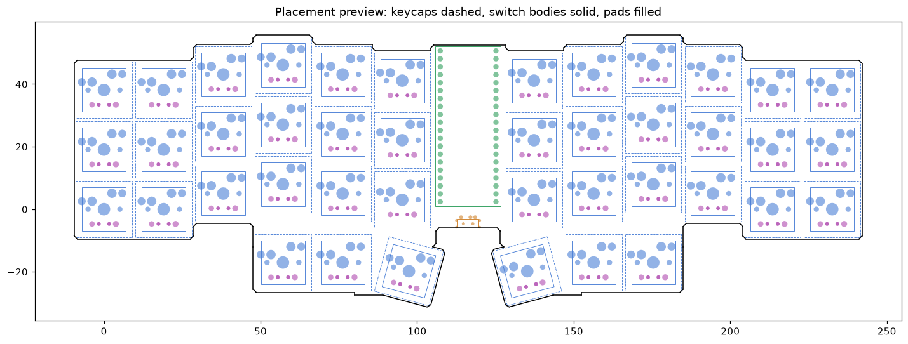

# Steno/QWERTY dual-mode keyboard

A 42-key keyboard (3×12 + 6 thumb keys) that works as a normal QWERTY keyboard
or as a steno machine that translates chords **on the keyboard itself**, so the
computer needs no Plover install.

## Status

| Part | State |
|---|---|
| PCB (`hardware/`) | placed and netlisted, **not routed yet**. Ergogen generates `hardware/ergogen/output/pcbs/steno_qwerty.kicad_pcb`; traces still need routing in KiCad |
| Firmware (`firmware/`) | **draft, never run on hardware.** The steno engine works on a desktop against Plover's real dictionary; USB and matrix code is untested |
| Dictionary compiler (`tools/build_dictionary.py`) | works: Plover `main.json` → 2.8 MB binary file |

## Hardware constraint found so far

Plover's default dictionary is still ~2.6 MB after compiling to a compact
binary format. A standard Raspberry Pi Pico (2 MB flash, ~1 MB free under
CircuitPython) **cannot hold it**. The PCB uses the standard Pico footprint,
but fit a module with ≥4 MB of flash (Raspberry Pi Pico 2) or, better, 16 MB.

## PCB



- 42 MX switches with Kailh hotswap sockets, one diode per key (SOD-123 or THT 1N4148)
- Raspberry Pi Pico-footprint module, soldered through-hole, USB at the top edge
- MSK-12C02 slide switch at the bottom notch: GP22 to GND, closed = steno
- Matrix: rows GP6–GP9, columns GP0–GP5 (left) and GP21–GP16 (right), matching `firmware/stenokb/config.py`
- Board is ~250 × 88 mm: over JLCPCB's 100 × 100 mm budget tier, so expect ~$25–40 for 5 bare boards

Regenerate and check it:

```sh
npx ergogen@4.2.1 hardware/ergogen -o hardware/ergogen/output --clean
python3 hardware/tools/check_pcb.py hardware/ergogen/output/pcbs/steno_qwerty.kicad_pcb --png docs/pcb-preview.png
```

`check_pcb.py` is a quick placement check (single board outline, pads inside
it, no colliding switches/keycaps/Pico/switch), not a substitute for KiCad's DRC.

### Remaining steps before ordering

1. Open the `.kicad_pcb` in KiCad 8/9 and route it: by hand, with Freerouting
   (export Specctra DSN, route, import SES), or with Quilter.
2. Add GND fill zones on both layers and run DRC.
3. Plot Gerbers and drill files and upload them to JLCPCB/PCBWay.
